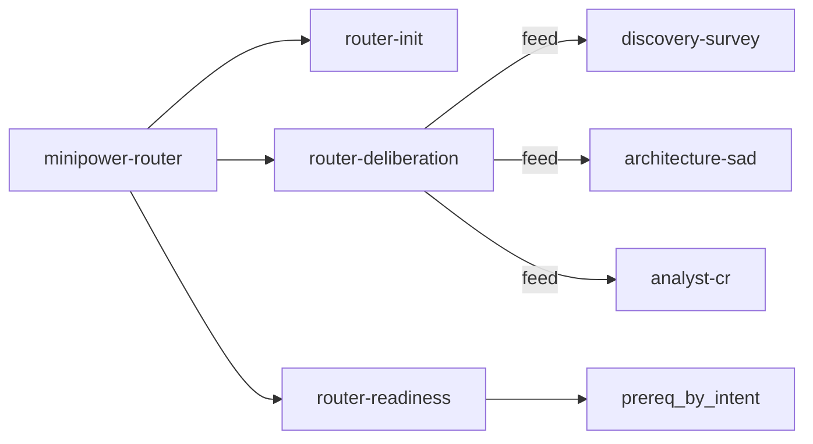
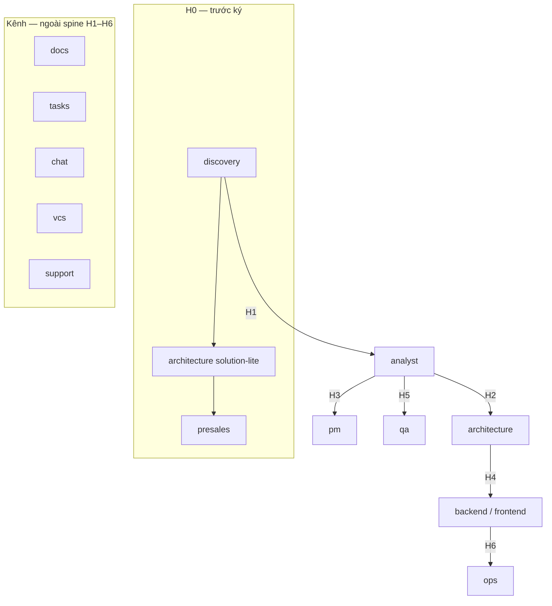

# Router, hook máy và phụ thuộc skill

[← README](README.md) · Liên quan: [pipeline.md](pipeline.md) (phase & artifact) · [contracts/handoff.md](../../../contracts/handoff.md) (H0–H6)

Tài liệu mô tả **cách Minipower điều phối** giữa người dùng, hook IDE, dispatcher (`minipower-router`) và catalog skill lá trong các pack nghề/kênh. Đây là mô hình **framework** (repo Minipower), không phải hồ sơ một dự án đích cụ thể.

## 1. Định vị

| Khái niệm | Vai trò |
|-----------|---------|
| **Router (pack `router/`)** | Dispatcher: gợi ý **đúng một** pack hoặc skill lá cho phiên hiện tại. **Không** orchestrator runtime, **không** spawn agent, **không** gọi MCP L3 thay pack nghề. |
| **Route = LLM** | Agent chọn **đúng một** `name:` trong SKILL.md đã cài (ADR-034 QĐ-4). |
| **`intent-dispatch.js`** | Bảng keyword → skill: **gợi ý / test vàng**, không thay bước chọn của LLM. |
| **`rules.json`** | SSOT cho phase↔DOC, `project_mode`, `prereq_by_intent`, danh sách hook cài. Bảng generated trong SKILL.md: `npm run gen`. |
| **Pack nghề / kênh** | Đơn vị cài (`discovery`, `analyst`, `backend`, `docs`, …). Manifest: `src/{pack}/PACK.md`. |
| **Skill lá** | Một thư mục `skills/minipower-{pack}-{capability}/SKILL.md` — SOP thi hành một việc. |

Triết lý bất biến: **con người là gatekeeper**; AI chuẩn bị và fan-out theo module, không tự bàn giao agent. Chi tiết gate: [minipower-router/SKILL.md](../skills/minipower-router/SKILL.md#phân-tầng-công-việc-micro--light--full).

## 2. Điều kiện bật Minipower trên dự án đích

Trên cây thư mục làm việc phải có marker `.minipower/` (sau `minipower init`). Không có marker → agent làm việc thường, không ép pack ([rules/dispatch.md](../rules/dispatch.md)).

Một phiên làm việc: **một pack**, không mở pack thứ hai song song trong cùng phiên.

## 3. Luồng runtime (prompt → skill)

```mermaid
flowchart TB
  subgraph Hooks["Hook prompt / pre_tool (sau install)"]
    U[User prompt]
    TG[token-guard]
    AR[auto-routing]
    PF[profile-guard]
    PR[prereq-gate]
    DS[decision-staleness]
    BG[baseline-guard]
    U --> TG --> AR --> PF --> PR --> DS
    DS --> AG[Agent]
    BG -.->|Read / Write / Edit| AG
  end

  subgraph Dispatch["Dispatcher"]
    MR[minipower-router]
    CAT[Catalog skill lá]
    ID[intent-dispatch.js]
    MR -->|1 skill| CAT
    ID -.-> gợi ý / test
  end

  AG --> MR
  CAT --> SOP[Đọc SKILL.md lá được chọn]
  AR -.->|enrich Phase + @path| AG
```

Thứ tự hook cài (SSOT: `install_hooks` trong [hooks/lib/rules.json](../hooks/lib/rules.json)):

| Shim | Slot | Việc chính |
|------|------|------------|
| `token-guard` | prompt | Scope Phase/Module/DOC; chặn `@` cả thư mục |
| `auto-routing` | prompt | Map DOC → phase; chèn `Phase:` và `@…/SKILL.md` khi rõ một phase |
| `profile-guard` | prompt | `memory/profile.json` hợp lệ |
| `prereq-gate` | prompt | Intent thực thi vs DOC tiền đề (`prereq_by_intent` × `project_mode`) |
| `decision-staleness` | prompt | DEC cũ / mâu thuẫn |
| `baseline-guard` | pre_tool | Chặn sửa `docs/02-baseline/` |

**Cứng bằng máy, mềm bằng lời:** hook kiểm tra tồn tại file, baseline, profile, prereq DOC; verdict PROCEED/PASS/RESHAPE là phán đoán **người**, không có hook FAIL trên chữ ký QC.

## 4. Bốn skill thuộc pack router

| Skill | Khi dùng | Output / hành vi |
|-------|----------|------------------|
| [minipower-router](../skills/minipower-router/SKILL.md) | Không biết pack nào, «làm gì tiếp», chọn skill | Thông báo `Sẽ chạy \`…\` để xử lý …` rồi đọc SOP lá |
| [minipower-router-init](../skills/minipower-router-init/SKILL.md) | Khởi tạo dự án | **Nhắc CLI** `minipower init` — không LLM ghi profile |
| [minipower-router-deliberation](../skills/minipower-router-deliberation/SKILL.md) | Full: premise, có nên làm | PROCEED / RESHAPE / STOP → `memory/decision-log`, `open-questions` |
| [minipower-router-readiness](../skills/minipower-router-readiness/SKILL.md) | Trước code / test / deploy | Soát intent; hỏi **trọn gói một lượt** thiếu sót; hoãn → memory |



**Phân tầng micro / light / full** (router SKILL): deliberation bắt buộc ở **Full**; `*-review` trong pack nghề khuyến nghị (light) hoặc bắt người ký (full). Discovery scope mới và change-control **luôn Full**.

## 5. Gợi ý pack theo intent (dispatcher)

Bảng trong [minipower-router/SKILL.md](../skills/minipower-router/SKILL.md) — tóm tắt:

| Ngữ cảnh người gõ | Pack / khu vực |
|-------------------|----------------|
| init, `project_mode` | `router-init` |
| premise, nghị luận | `router-deliberation` |
| soát tiền đề trước thực thi | `router-readiness` |
| DOC-01/02/03, painpoint | `discovery/` |
| UC, FR, SRS, AC, prototype, CR nội dung | `analyst/` |
| SAD, ADR, API, SOL | `architecture/` |
| WBS, kế hoạch, ticket CR | `pm/` |
| registry, publish | `support/` |
| test strategy, autotest | `qa/` |
| deploy, incident, metrics | `ops/` |
| báo giá, ULNL | `presales/` |
| Outline | `docs/` |
| OpenProject / Lark task | `tasks/` |
| Slack / Lark IM | `chat/` |
| GitLab MR | `vcs/` |
| .NET Jarvis | `backend/` |
| React `@platform/core` | `frontend/` |
| as-built / legacy | `minipower-architecture-as-built` |
| viết skill / module mới | `toolbox/` |

Keyword chi tiết: [lib/intent-dispatch.js](../lib/intent-dispatch.js) (`INTENT_RULES`).

## 6. Phase, DOC và skill lá mặc định (auto-routing)

Map DOC → phase: `phase_by_doc` trong [rules.json](../hooks/lib/rules.json). Hook `auto-routing` khi phát hiện **một** phase từ prompt/file, có thể enrich:

| Phase | Skill lá mặc định (đường dưới `src/`) |
|-------|----------------------------------------|
| `discovery` | `discovery/skills/minipower-discovery-survey/SKILL.md` |
| `requirements` | `analyst/skills/minipower-analyst-srs/SKILL.md` |
| `architecture` | `architecture/skills/minipower-architecture-sad/SKILL.md` |
| `planning` | `pm/skills/minipower-pm-plan/SKILL.md` |
| `change-control` | `analyst/skills/minipower-analyst-cr/SKILL.md` |
| `delivery` + DOC-16 | `qa/skills/minipower-qa-strategy/SKILL.md` |
| `delivery` + DOC-17 | `ops/skills/minipower-ops-deploy/SKILL.md` |

Xung đột `Phase:` trong prompt vs phase suy ra từ DOC → hook **block** và hướng dẫn sửa prompt ([auto-routing.js](../hooks/lib/auto-routing.js)).

Luồng artifact theo phase: [pipeline.md](pipeline.md).

## 7. Tiền đề theo intent (`prereq-gate`)

Dữ liệu: `prereq_by_intent` trong `rules.json`. Bảng đầy đủ (generated): [router-readiness/SKILL.md](../skills/minipower-router-readiness/SKILL.md).

| Intent `id` | DOC yêu cầu (standard) |
|-------------|-------------------------|
| `write-requirements` | 03 |
| `prototype` | 04 |
| `design-architecture` | 03, 06, 13 |
| `implement` | 06, 07, 08, 11, 12, 19 |
| `test` | 06, 07, 16 |
| `deploy` | 15, 17 |

`project_mode` (`mvp`, `maintain`) có `prereq_overrides` — nhẹ hơn `standard`; gate `prereq` có thể **warn** thay vì block. Kiểm **theo module** khi DOC scope = module ([`doc_scope`](../hooks/lib/rules.json)).

## 8. Spine pack: handoff H0–H6

Boundary có tên: [contracts/handoff.md](../../../contracts/handoff.md). Mỗi boundary **per-module** — module A qua H4 trong khi module B còn ở H2 là trạng thái hợp lệ.



| Pack | `consumes` (tóm tắt) | `produces` (tóm tắt) | Handoff |
|------|----------------------|----------------------|---------|
| discovery | biên bản, painpoint | DOC-01–03, SUR-* | out H0, H1 |
| presales | khảo sát, SOL-* lite | estimate, quotation | in H0 |
| analyst | DOC-03 | UC/FR/BR/AC, DOC-04–07, 13, 19 | in H1; out H2, H3, H5 |
| architecture | DOC-03, 06, 13 | SOL-*, DOC-08–12, ADR | in H2; out H4 |
| pm | DOC-06 Must-have | DOC-14, 15, 18 | in H3 |
| backend / frontend | DOC-08, 11, 12, FR/AC | CMP-*, code traced | in H4; out H6 |
| qa | DOC-07, 16, AC | TEST-* | in H5 |
| ops | DOC-17 | runbook, incident | in H6 |
| router | intent, profile | gợi ý pack | — |
| toolbox | AGENTS, contracts, PACK | skill/module mới | meta-repo |

Manifest đầy đủ: `src/{pack}/PACK.md`.

## 9. Cấu trúc catalog skill lá

Quy ước tên: `minipower-{module}-{capability}[-{stack}]` — thư mục lá ≡ `name:` trong frontmatter, bắt buộc `description`.

```text
src/
  router/skills/minipower-router*/
  discovery/skills/minipower-discovery-{survey|review}
  analyst/skills/minipower-analyst-{srs|review|cr}
  architecture/skills/minipower-architecture-{solution-lite|sad|review|as-built}
  pm/skills/minipower-pm-{plan|cr-track}
  qa/skills/minipower-qa-{strategy|review}
  ops/skills/minipower-ops-{deploy|incident|metrics}
  presales/skills/minipower-presales-{estimation-ulnl|quotation}
  support/skills/minipower-support-{registry|publish}
  backend/skills/minipower-backend-*-dotnet/   (+ providers/, patterns/ con)
  frontend/skills/minipower-frontend-*-react/    (+ patterns/ con)
  docs|tasks|chat|vcs/skills/…
  toolbox/skills/minipower-toolbox-skill-author
```

**Phụ thuộc nội bộ pack:** lá cha (ví dụ `authentication-dotnet`) trỏ variant trong `providers/` hoặc `patterns/` — vẫn **một** lá được dispatcher chọn; variant không đăng ký riêng trong `INTENT_RULES` trừ khi có keyword riêng.

**Review pack:** `minipower-{pack}-review` — QC gate mềm; không sửa DOC của owner khác (fan-out review: một subagent / chiều hoặc / module, agent chính dedup finding).

Test catalog + intent: `src/router/hooks/test/minipower-catalog.test.js`, `intent-dispatch.test.js`.

## 10. Chế độ dự án (`project_mode`)

Sống ở `memory/profile.json` (schema v2). Không cắt folder — chỉ đổi DOC cần điền và mức `prereq-gate`. Bảng generated: [minipower-router#chế-độ-dự-án](../skills/minipower-router/SKILL.md#chế-độ-dự-án-project_mode).

## 11. Tài liệu liên quan

| Tài liệu | Nội dung |
|----------|----------|
| [pipeline.md](pipeline.md) | 6 phase, luồng folder `docs/` |
| [parallel-work.md](parallel-work.md) | Fan-out theo module, ownership |
| [token-guard.md](token-guard.md) | Scope đọc/sửa DOC |
| [decision-log.md](decision-log.md) | DEC, staleness |
| [contracts/trace-spine.md](../../../contracts/trace-spine.md) | ID UC→FR→AC→Test |
| [contracts/pack-manifest.md](../../../contracts/pack-manifest.md) | Schema PACK.md |
| [../README.md](../README.md) | Entry pack router |

## 12. Bảo trì khi đổi routing

1. Thêm intent prereq / DOC → sửa [rules.json](../hooks/lib/rules.json) → `npm run gen` → `npm test` → `npm run gen:check`.
2. Thêm keyword gợi ý skill → [intent-dispatch.js](../lib/intent-dispatch.js) + test `intent-dispatch.test.js`.
3. Đổi lá mặc định theo phase → [auto-routing.js](../hooks/lib/auto-routing.js) + test hook.
4. Pack mới → `PACK.md`, skill lá, cập nhật bảng pack trong router SKILL (nếu là nghề chính).

---

*Cập nhật cùng repo Minipower — khi lệch generated table, ưu tiên `rules.json` + `npm run gen`.*
