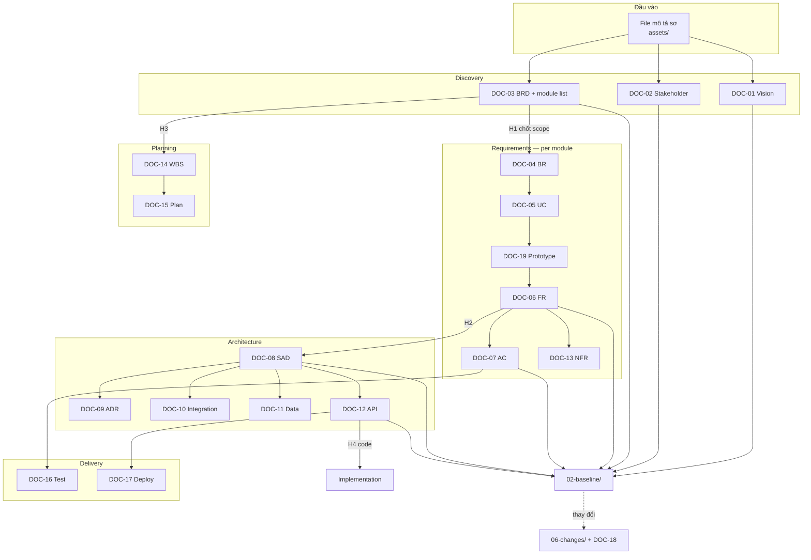

# Tutorial — Từ file mô tả sơ đến bộ tài liệu dự án

[← README](README.md) · Xem thêm: [pipeline.md](pipeline.md) · [handoff](../../contracts/handoff.md)

Hướng dẫn này trả lời câu hỏi: **“Tôi chỉ có một file mô tả sơ (không phải URD chuẩn chỉnh) — dùng Minipower thì làm gì tiếp, mỗi bước ra tài liệu gì?”**

Minipower không yêu cầu bạn có URD hoàn chỉnh ngay từ đầu. File mô tả sơ là **đầu vào hợp lệ** — nó đi vào `assets/`, được distill qua discovery thành DOC-01–03, rồi fan-out theo module.

---

## Tóm tắt một dòng

```text
File thô (assets/) → Discovery (DOC-01–03) → Requirements theo module (DOC-04–07, 19, 13)
→ Architecture (DOC-08–12) → Planning (DOC-14–15) → Delivery (DOC-16–17) → Baseline → CR (DOC-18)
```

Con người chốt ở từng chặng; AI chuẩn bị nháp. Thiếu thì ghi `TBD`, không bịa.

---

## Trước khi bắt đầu

### Cài Minipower vào IDE

```bash
node cli/minipower.mjs install
```

Chọn client (Cursor / Claude / OpenCode) và pack cần dùng. Chi tiết: [README gốc § Hướng dẫn bắt đầu](../../../README.md#hướng-dẫn-bắt-đầu).

### Khởi tạo dự án

Trong folder dự án (ví dụ `acme-order/`):

```bash
node .minipower/bin/minipower init
```

Script hỏi `project_mode` và bề mặt (`docs`, `backend`, `frontend`…). Kết quả:

| Thư mục | Vai trò |
|---------|---------|
| `assets/` | **Giữ bản gốc** — file mô tả sơ của bạn đặt ở đây, không sửa |
| `brainstorm/` | Nháp trao đổi theo ngày — chưa phải artifact chính thức |
| `docs/` | Artifact chính thức (DOC-01 → DOC-19) |
| `memory/` | Sổ đội: `decision-log.md`, `open-questions.md`, `doc-debt.md` |

Cấu trúc `docs/` copy từ [docs-skeleton](../docs-skeleton/README.md). Mọi chế độ (`mvp` · `standard` · `maintain`) dùng **cùng khung folder** — chỉ khác *DOC nào cần điền ngay*.

### Chọn chế độ dự án

| Chế độ | Khi nào | DOC ưu tiên điền trước |
|--------|---------|------------------------|
| **`mvp`** | Demo nhanh, 2–4 tuần | DOC-01, 03, 06, 07, 09, 17 |
| **`standard`** | Outsource, nghiệm thu theo tài liệu | Đủ 19 DOC + baseline |
| **`maintain`** | Tiếp quản hệ cũ, tài liệu thất lạc | DOC-04, 08–12, 17, 18 (khai quật as-built) |

Phần còn lại của tutorial mô tả luồng **`standard`** (đầy đủ). Cuối bài có [lối tắt MVP](#lối-tắt-mvp).

---

## Ví dụ đầu vào

Giả sử bạn có file `assets/internal/yeu-cau-ban-hang.md`:

```markdown
# Yêu cầu sơ — Module bán hàng

Khách hàng ABC muốn team sales tạo đơn hàng trên web, gửi duyệt cho trưởng phòng,
sau đó đẩy sang kế toán. Hiện đang dùng Excel, hay sai số, không biết đơn nào đã duyệt.

Cần làm trong Q2. Ngân sách chưa chốt. Tích hợp ERP sau — đợt 1 chỉ cần export CSV.
```

Đây **chưa phải** URD, BRD hay SRS — và **không cần** chuẩn hóa trước khi đưa vào Minipower.

---

## Bước 0 — Lưu file gốc, không sửa

| Việc | Ai | Đầu ra |
|------|-----|--------|
| Copy file mô tả sơ vào `assets/internal/` hoặc `assets/public/` | Bạn | File gốc nguyên vẹn |
| (Tuỳ chọn) Ghi chú phiên làm việc vào `brainstorm/YYYY-MM-DD-khao-sat.md` | Bạn + AI | Nháp trao đổi |

**Quy tắc:** `assets/` = bản gốc tham chiếu. Nội dung chốt distill vào `docs/`, không sửa file trong `assets/`.

---

## Bước 1 — Discovery: từ file thô → phạm vi dự án

**Skill:** `minipower-discovery-survey`  
**Prompt mẫu:**

> `@assets/internal/yeu-cau-ban-hang.md` — Khảo sát painpoint, lập DOC-01 đến 03. Chưa viết FR/AC.

**Trước khi elicit:** AI chạy premise gate (`minipower-router-deliberation`) — xác nhận *có đáng làm không* (PROCEED / RESHAPE / STOP). Verdict do **bạn** quyết.

### Đầu ra

| DOC | File | Nội dung chính |
|-----|------|----------------|
| **DOC-01** | `docs/01-project/DOC-01-vision-business-case.md` | Vì sao làm, mục tiêu kinh doanh, success metrics |
| **DOC-02** | `docs/01-project/DOC-02-stakeholder-analysis.md` | Stakeholder, RACI sơ bộ |
| **DOC-03** | `docs/01-project/DOC-03-brd.md` | **In/out scope**, danh sách module, assumption |

Ví dụ sau discovery, DOC-03 có thể khai báo:

```text
Module in scope:
- ORD — Đơn hàng (Must, đợt 1)
- RPT — Báo cáo export CSV (Should, đợt 1)

Out of scope:
- Tích hợp ERP realtime (đợt 2)
```

### Điểm chốt (H1 — Discovery → Requirements)

Bạn review DOC-03: scope và danh sách module đã đúng chưa?  
Chưa ổn → sửa DOC-01–03, **không** nhảy sang viết FR.

**QC (tuỳ chọn):** `minipower-discovery-review` — soi gói khảo sát (đã nhảy giải pháp sớm chưa?).

### Nếu cần báo giá trước ký hợp đồng (H0)

Luồng presales — **sau** discovery, **trước** SRS đầy đủ:

1. `minipower-architecture-solution-lite` → phương án mức bán (`SOL-*`)
2. `minipower-presales-estimation-ulnl` → estimate
3. `minipower-presales-quotation` → tờ giá

Presales **không** khảo sát lại và **không** thay BA viết FR.

---

## Bước 2 — Requirements: từng module một

**Skill:** `minipower-analyst-srs`  
**Tiên quyết:** DOC-03 đã review (H1).  
**Folder:** `docs/03-modules/{module-id}/` — mỗi module một owner.

**Prompt mẫu (module ORD):**

> Module ORD trong DOC-03. Viết DOC-04 → 05 → 19 → 06 → 07 cho luồng tạo và duyệt đơn. Prefix ID: ORD.

### Thứ tự khuyến nghị và đầu ra

| Bước | DOC | File (trong `03-modules/ORD/`) | Nội dung |
|------|-----|--------------------------------|----------|
| 1 | **DOC-04** | `DOC-04-business-rules.md` | Rule nghiệp vụ: trạng thái đơn, ai duyệt, giới hạn số tiền… |
| 2 | **DOC-05** | `DOC-05-use-cases.md` | Actor, UC: `ORD-UC-001` Tạo đơn, `ORD-UC-002` Duyệt đơn… |
| 3 | **DOC-19** | `DOC-19-prototype.md` | Wireframe / luồng màn hình (cổng chốt trước SRS chi tiết) |
| 4 | **DOC-06** | `DOC-06-srs.md` | Functional requirements: `ORD-FR-001`, `ORD-FR-002`… trace UC/BR |
| 5 | **DOC-07** | `DOC-07-acceptance-criteria.md` | AC Gherkin: `ORD-AC-001` trỏ `ORD-FR-001` |
| 6 | **DOC-13** | `docs/04-platform/DOC-13-nfr.md` | NFR dự án: performance, security, audit… |

Song song cập nhật `docs/05-traceability/trace-matrix.md` — một dòng per FR/AC.

### Điểm chốt trong module

- Prototype (DOC-19) đã phản ánh đúng luồng nghiệp vụ?
- FR Must-have đủ để SA thiết kế slice đầu tiên?

**QC (tuỳ chọn):** `minipower-analyst-review` — trace UC→FR→AC, negative case.

### Nhiều module — không chờ nhau

`ORD` có thể qua H2 (sang kiến trúc) trong khi `RPT` còn đang viết UC. Mỗi module một nhịp — xem [parallel-work.md](parallel-work.md).

| Boundary | Điều kiện tối thiểu (per module) |
|----------|-----------------------------------|
| **H2** Requirements → Architecture | DOC-06 + DOC-13 draft của module đó |
| **H3** Requirements → Planning | DOC-06 Must-have của module đó |

---

## Bước 3 — Architecture: giải pháp kỹ thuật

**Skill:** `minipower-architecture-sad`  
**Tiên quyết:** DOC-06 + DOC-13 của module đang thiết kế (H2).  
**Folder:** `docs/04-platform/`

**Prompt mẫu:**

> Thiết kế SAD và API slice cho module ORD. Trace `ORD-FR-001`… `ORD-FR-00N`. Viết DOC-08, 09, 10, 11, 12.

### Đầu ra

| DOC | File | Nội dung |
|-----|------|----------|
| **DOC-08** | `DOC-08-sad.md` | SAD 4+1 views |
| **DOC-09** | `DOC-09-adr.md` (hoặc `adr/ADR-NNN-*.md`) | Quyết định kiến trúc — 1 ADR / quyết định |
| **DOC-10** | `DOC-10-integration-specification.md` | Tích hợp (đợt 1: export CSV) |
| **DOC-11** | `DOC-11-data-model.md` | ERD, entity Order, OrderLine… |
| **DOC-12** | `DOC-12-api-specification.md` | OpenAPI: `POST /orders`, `PATCH /orders/{id}/approve`… |

API và data model **phải trace** về FR (`ORD-FR-*`).

### Điểm chốt (H4 — Architecture → Implementation)

Đủ DOC-08 + DOC-11 + DOC-12 **slice** cho module → dev có thể bắt đầu code (repo code riêng, nếu có).

Trước khi code, AI có thể chạy `minipower-router-readiness` — liệt kê **một lượt** tiền đề còn thiếu; bạn chọn trả lời / hoãn ghi nợ / bỏ qua.

**QC (tuỳ chọn):** `minipower-architecture-review`.

---

## Bước 4 — Planning: kế hoạch và ước lượng

**Skill:** `minipower-pm-plan`  
**Tiên quyết:** DOC-03 + FR Must-have (H3).

| DOC | File | Nội dung |
|-----|------|----------|
| **DOC-14** | `docs/00-governance/DOC-14-wbs-estimate.md` | WBS, Story Point / estimate |
| **DOC-15** | `docs/00-governance/DOC-15-project-plan.md` | Lịch, milestone, rủi ro tiến độ |

PM **không** sửa FR — chỉ lập kế hoạch từ SRS đã có.

---

## Bước 5 — Delivery: test và triển khai

### QA

**Skill:** `minipower-qa-strategy`

| DOC | File | Nội dung |
|-----|------|----------|
| **DOC-16** | `docs/03-modules/ORD/DOC-16-test-strategy.md` | Test strategy, scenario `ORD-TEST-001` → `ORD-AC-001` |

**Boundary H5:** DOC-07 AC + DOC-16 → QA bắt đầu viết/ chạy test.

### Ops

**Skill:** `minipower-ops-deploy`

| DOC | File | Nội dung |
|-----|------|----------|
| **DOC-17** | `docs/04-platform/DOC-17-deployment-guide.md` | Runbook deploy, cutover checklist |

**Boundary H6:** build artifact + DOC-17 → go-live.

---

## Bước 6 — Baseline: chốt phiên bản

Khi DOC-01–07 + trace matrix + review DOC-08–12 đạt mức ký:

1. PM/sponsor sign-off
2. Snapshot copy vào `docs/02-baseline/v1.0/` — **chỉ đọc** sau này
3. Cập nhật `docs/05-traceability/doc-registry.md`

Sau baseline, **không sửa trực tiếp** file đã ký — mọi thay đổi qua CR.

**Rà còn thiếu:** `minipower-support-registry` — so với `project_mode`, nhắc DOC chưa điền (không sửa nội dung FR).

---

## Bước 7 — Sau baseline: Change Request

**Skill:** `minipower-analyst-cr` (nội dung) + `minipower-pm-cr-track` (ticket)

| DOC | File | Nội dung |
|-----|------|----------|
| **DOC-18** | `docs/00-governance/DOC-18-change-request-register.md` | Register CR |
| Delta | `docs/06-changes/CR-003/` | Diff FR/AC/API bị ảnh hưởng |

---

## Sơ đồ luồng đầy đủ



---

## Bảng tra nhanh: bước → skill → DOC

| # | Bạn có gì | Làm gì tiếp | Skill | DOC ra |
|---|-----------|-------------|-------|--------|
| 0 | File mô tả sơ | Copy vào `assets/` | — | — |
| 1 | File trong `assets/` | Khảo sát, chốt scope | `minipower-discovery-survey` | 01, 02, 03 |
| 1b | Cần báo giá | Phương án mức bán + giá | `architecture-solution-lite` → presales | SOL-* (không phải DOC) |
| 2 | DOC-03 đã review | Viết SRS theo module | `minipower-analyst-srs` | 04, 05, 19, 06, 07, 13 |
| 3 | FR draft module X | Thiết kế kiến trúc slice X | `minipower-architecture-sad` | 08, 09, 10, 11, 12 |
| 4 | FR Must-have | Lập kế hoạch | `minipower-pm-plan` | 14, 15 |
| 5a | AC + test cần | Chiến lược test | `minipower-qa-strategy` | 16 |
| 5b | Sắp deploy | Runbook | `minipower-ops-deploy` | 17 |
| 6 | Gói đủ ký | Baseline | (thủ công + support-registry) | snapshot `02-baseline/` |
| 7 | Đổi sau ký | CR | `analyst-cr` + `pm-cr-track` | 18 + `06-changes/` |

---

## Lối tắt MVP

Với `project_mode: mvp`, ưu tiên đường ngắn:

```text
assets/ (file thô)
  → DOC-01 + DOC-03 (scope + module)     [discovery-survey — rút gọn]
  → DOC-06 + DOC-07 (FR + AC Must)        [analyst-srs — bỏ qua prototype nếu UI đơn giản]
  → DOC-09 (ADR quan trọng)               [architecture-sad — chỉ quyết định then chốt]
  → DOC-17 (deploy tối thiểu)               [ops-deploy]
  → code + demo
```

DOC chưa điền ghi vào `memory/doc-debt.md` — trả nợ khi lên `standard`.

Hook `prereq-gate` ở MVP chỉ **nhắc**, không chặn cứng như `standard`.

---

## Cách gọi AI trong từng bước

| Cách | Ví dụ |
|------|-------|
| Chat Agent + mô tả việc | *“Khảo sát file trong assets, lập DOC-01 đến 03”* |
| `/minipower-router` + mô tả | Dispatcher chọn pack phù hợp |
| `/minipower-discovery-survey` | Gọi thẳng lá discovery |
| `@` file SKILL | `@discovery/skills/minipower-discovery-survey/SKILL.md` |
| `@` file DOC đang sửa | Hook `auto-routing` gắn phase theo DOC |

Agent sẽ thông báo: *Sẽ chạy `minipower-…` để xử lý …* trước khi làm.

---

## Việc không nên làm

| Sai | Đúng |
|-----|------|
| Viết FR ngay từ file thô, bỏ qua DOC-03 | Discovery trước → chốt scope → rồi SRS |
| Sửa file trong `assets/` | Distill vào `docs/`; `assets/` giữ nguyên |
| Chờ mọi module xong mới thiết kế kiến trúc | Module xong trước đi trước (H2/H4 per module) |
| Bịa nghiệp vụ khi thiếu thông tin | Ghi `TBD` + câu hỏi vào `memory/open-questions.md` |
| Sửa trực tiếp `02-baseline/` sau ký | Mở CR trong `06-changes/` |

---

## Liên kết

- [pipeline.md](pipeline.md) — nguyên tắc pipeline 6 phase
- [parallel-work.md](parallel-work.md) — nhiều module song song
- [Template DOC-01→19](../templates/README.md) — khung copy-paste
- [docs-skeleton](../docs-skeleton/README.md) — cấu trúc folder `docs/`
- [handoff](../../contracts/handoff.md) — boundary H0–H6
- [trace-spine](../../contracts/trace-spine.md) — quy tắc ID UC/FR/AC
